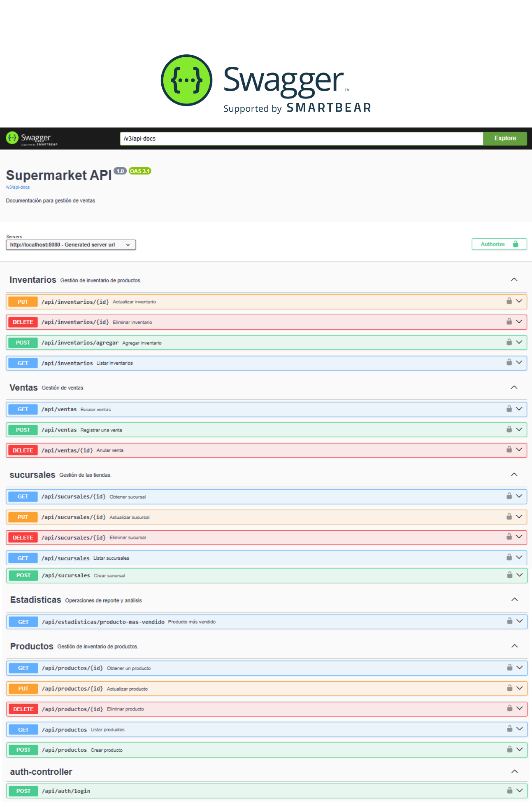
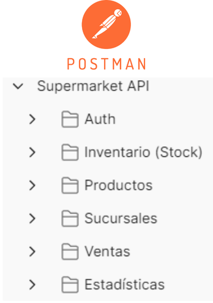

# 🛒 Supermercado Ventas API

API RESTful profesional desarrollada con **Spring Boot 3** para la gestión integral de ventas, sucursales e inventarios en tiempo real. Este proyecto implementa un sistema robusto de control de stock y seguridad avanzada.

---

## 🚀 Características Principales

* **Gestión Transaccional de Ventas**: Registro de ventas con múltiples productos, cálculo automático de totales y validación de stock en tiempo real.
* **Control de Inventario Dinámico**: Descuento de existencias tras una venta y reposición automática al anular transacciones (borrado lógico).
* **Seguridad JWT**: Autenticación y autorización basada en tokens. Los métodos de consulta (GET) son públicos, mientras que las operaciones de escritura están protegidas.
* **Business Intelligence**: Endpoints dedicados para obtener estadísticas, como el producto más vendido, y filtros avanzados por fecha y sucursal.
* **Integridad de Datos**: Reglas de negocio que impiden eliminar entidades con dependencias activas (ej. no borrar productos con ventas asociadas).

---

## 🛠️ Stack Tecnológico

* **Java 21 (LTS)**: Aprovechando las últimas optimizaciones del lenguaje.
* **Spring Boot 3.4.2**: Framework principal para el desarrollo de microservicios.
* **Spring Data JPA**: Gestión de persistencia con MySQL.
* **Spring Security & JJWT**: Implementación de seguridad Stateless.
* **JUnit 5 & Mockito**: Suite completa de tests unitarios y de integración.
* **Lombok**: Reducción de código boilerplate.
* **Springdoc-OpenAPI (Swagger)**: Documentación interactiva de la API.

---

## 🧪 Pruebas y Validación

El proyecto incluye una batería de **40 pruebas unitarias y de integración** que aseguran el correcto funcionamiento de los controladores y servicios.

* **Framework**: JUnit & Mockito.
* **Ejecución**: Puedes correr las pruebas localmente con `mvn test`.
* **Tests Unitarios**: Validación de la lógica de negocio aislada en la capa de Service utilizando Mockito.
* **Tests de Integración**: Pruebas de flujo completo con MockMvc y `@Transactional` para asegurar un rollback automático que no afecte la base de datos.
* **Persistencia en Test**: Se utiliza un perfil específico (`application-test.properties`) que limpia la base de datos después de cada ejecución para garantizar pruebas aisladas y deterministas.

---

## 📋 Requisitos e Instalación

1.  **Clonar el repositorio**:
    ```bash
    git clone [https://github.com/Edu-GD/supermercado-ventas-api](https://github.com/Edu-GD/supermercado-ventas-api)
    ```

2.  **Configurar la base de datos**: Ajustar las credenciales de MySQL en `src/main/resources/application.properties`.

3.  **Ejecutar la aplicación**:
    ```bash
    mvn spring-boot:run
    ```

4.  **Acceder a la documentación**: Una vez en marcha, visita: `http://localhost:8080/swagger-ui.html`.
   

---

## 🚀 Cómo Probar la API con Postman

1.  Abre **Postman**.
2.  Haz clic en el botón **Import**.
El proyecto incluye una colección de Postman completa ubicada en la raíz del repositorio. 
3.  Selecciona el archivo de colección ubicado en la raíz del proyecto (ej: `supermercado-ventas.postman_collection.json`).

Al importarla, tendrás acceso a las siguientes capacidades organizadas por módulos:

### 📦 Gestión de Inventario y Stock
* **Operaciones Protegidas**: Agregar, actualizar y eliminar registros de inventario.
* **Consultas**: Ver stock total, filtrar stock por sucursal, por producto o consultar el stock exacto de un producto en una sucursal específica.

### 🍎 Catálogo de Productos
* **Acceso Público**: Listado completo de productos.
* **Operaciones de Gestión**: Crear, obtener por ID, actualizar y eliminar productos del catálogo.

### 🏢 Gestión de Sucursales
* **Acceso Público**: Listado de sucursales.
* **Operaciones de Gestión**: Crear, obtener por ID, actualizar y eliminar sucursales.

### 💰 Flujo de Ventas
* **Transacciones**: Registro de ventas (múltiples versiones para pruebas de carga).
* **Historial y Filtros**: Buscar todas las ventas activas, ver historial completo (activas y anuladas) y filtros avanzados por sucursal, fecha o estado.
* **Anulación**: Endpoint protegido para anular ventas y revertir el stock automáticamente.

### 📊 Estadísticas
* **Análisis clave**: Consulta directa del producto más vendido en todo el sistema.



---

## 🔐 Seguridad y Autenticación

La API implementa un modelo de seguridad basado en **JWT** para proteger la integridad de los datos de ventas y clientes:

* **Público**: Acceso a consultas (GET) de productos y sucursales.
* **Protegido**: El sistema utiliza una clave de firma robusta para validar la autenticidad de los tokens.
* **Expiración**: Los tokens tienen una validez de 24 horas (`86400000 ms`) para equilibrar seguridad y usabilidad.
* **Acceso**: Para interactuar con endpoints protegidos, se debe incluir el token en el header:
    `Authorization: Bearer <tu_token_aquí>`

---

## 🔄 Gestión del Repositorio

Si necesitas limpiar tu entorno local y sincronizarte exactamente con la última versión estable subida a GitHub:

```bash
git fetch origin
git reset --hard origin/main

---

## 👥 Desarrolladores

El desarrollo de esta API ha sido llevado a cabo por:

* **Edu García**
* **Davide Pinna**
* **Carlos David**
* **Rubén Verde**

---
© 2026 - Proyecto Final: Gestión de Supermercado

